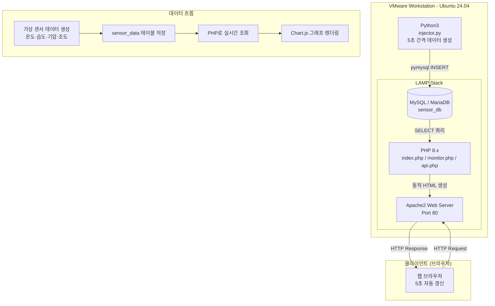
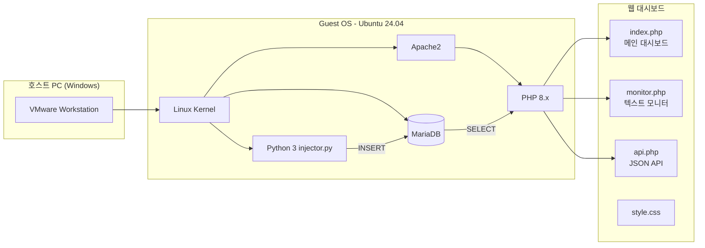
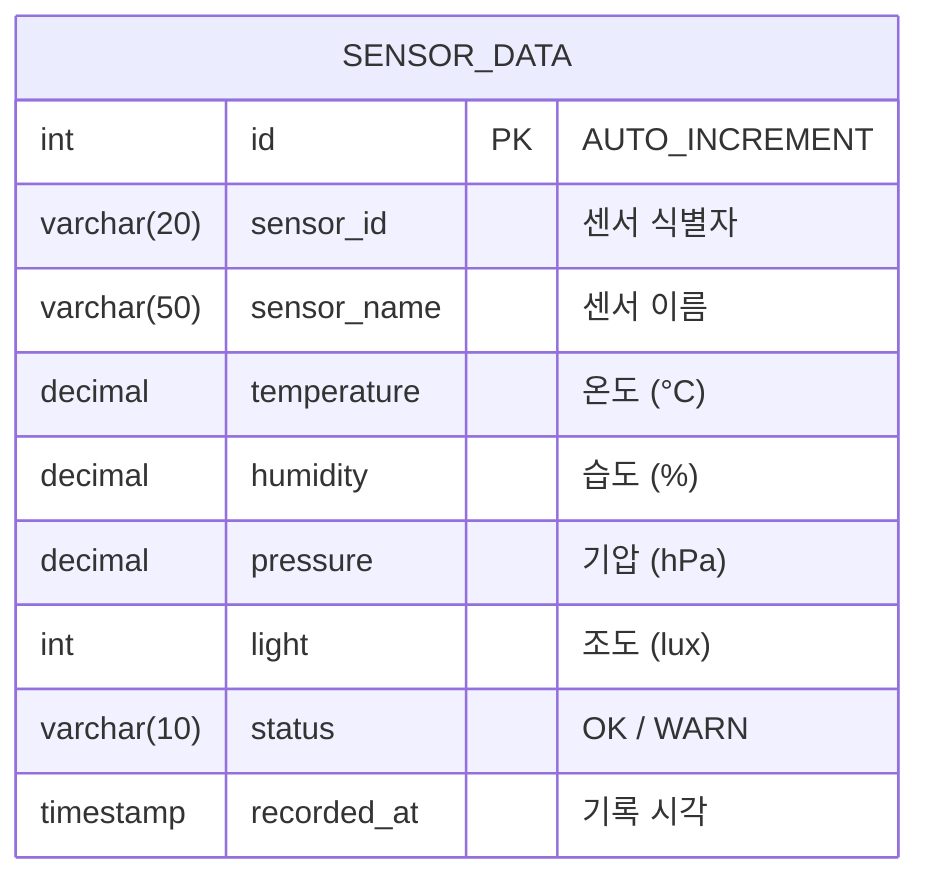
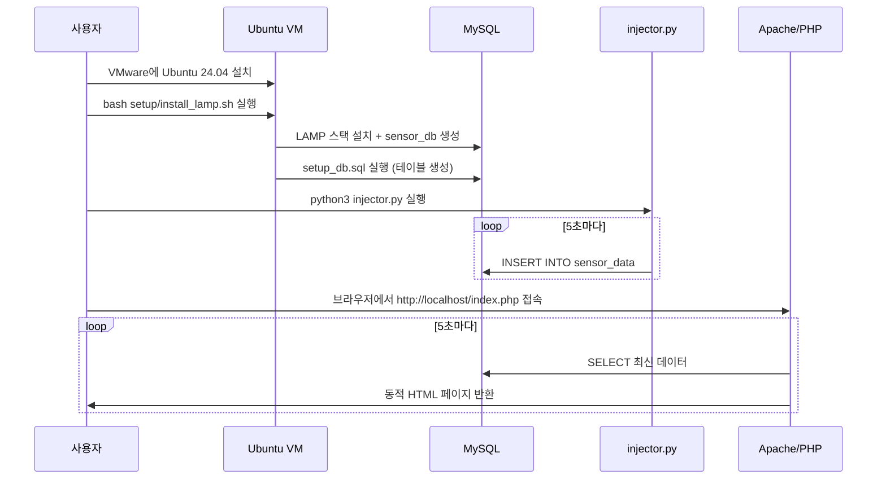

# Process Documentation

## LAMP Stack IoT 모니터링 시스템 구축 과정

---

## 1. 전체 시스템 블록도 (Mermaid)



---

## 2. 시스템 구성 상세



---

## 3. 데이터베이스 스키마



---

## 4. 설치 및 실행 순서



---

## 5. 구현 단계별 작업 내역

### Step 1: VMware + Ubuntu 24.04 환경 구성
- VMware Workstation Player 설치
- Ubuntu 24.04 LTS ISO 다운로드 및 가상머신 생성
  - RAM: 2GB 이상, HDD: 20GB 이상 권장
- 가상머신 부팅 후 네트워크(NAT) 설정 확인

### Step 2: LAMP 스택 설치
```bash
cd ~/Desktop/project2
chmod +x setup/install_lamp.sh
bash setup/install_lamp.sh
```
- Apache2, MySQL, PHP 8.x 자동 설치
- `sensor_db` 데이터베이스 및 `sensor_data` 테이블 생성
- `sensor_user` 계정 및 권한 설정

### Step 3: Python 데이터 주입기 실행
```bash
# 패키지 설치 (설치 스크립트가 처리하지만 수동으로도 가능)
pip3 install pymysql faker

# 데이터 주입 시작 (5초 간격)
python3 injector.py

# 또는 2초 간격
python3 injector.py --interval 2

# 1회만 실행
python3 injector.py --once
```

### Step 4: 웹 파일 배포
```bash
sudo cp web/*.php /var/www/html/
sudo cp web/style.css /var/www/html/
sudo chown -R www-data:www-data /var/www/html/
```

### Step 5: 모니터링 확인
- 브라우저에서 `http://localhost/index.php` 접속
- 실시간 센서 데이터 대시보드 확인
- `http://localhost/monitor.php` — 텍스트 스타일 모니터
- `http://localhost/api.php` — JSON API

### Step 6: GitHub 업로드
```bash
cd ~/Desktop/project2
git init
git add .
git commit -m "feat: LAMP Stack IoT monitoring system"
git remote add origin https://github.com/2101070-LJI/lamp-iot-monitor.git
git push -u origin main
```

---

## 6. 트러블슈팅 체크리스트

| 증상 | 원인 | 해결 |
|------|------|------|
| Apache 접속 불가 | 방화벽 차단 | `sudo ufw allow 80` |
| DB 연결 실패 | 비밀번호 불일치 | `setup_db.sql` 계정 정보 확인 |
| injector.py 오류 | pymysql 미설치 | `pip3 install pymysql` |
| PHP 에러 표시 | php-mysql 미설치 | `sudo apt install php-mysql` |
| 데이터가 안 보임 | injector.py 미실행 | `python3 injector.py` 실행 확인 |

---

## 7. 파일 구조

```
project2/
├── project.md          # 프로젝트 설명 (클로드 코드 skill 파일)
├── process.md          # 본 문서 (작업 과정 + Mermaid 블록도)
├── README.md           # GitHub 저장소 소개
├── injector.py         # Python 데이터 생성·주입 스크립트
├── setup/
│   ├── install_lamp.sh # LAMP 자동 설치 스크립트
│   ├── setup_db.sql    # DB/테이블 초기화 SQL
│   └── requirements.txt
├── web/
│   ├── index.php       # 메인 모니터링 대시보드
│   ├── monitor.php     # 텍스트 스타일 모니터
│   ├── api.php         # JSON API 엔드포인트
│   └── style.css       # 다크 테마 스타일시트
└── docs/
    └── submission.txt  # 제출 정보
```
